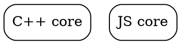
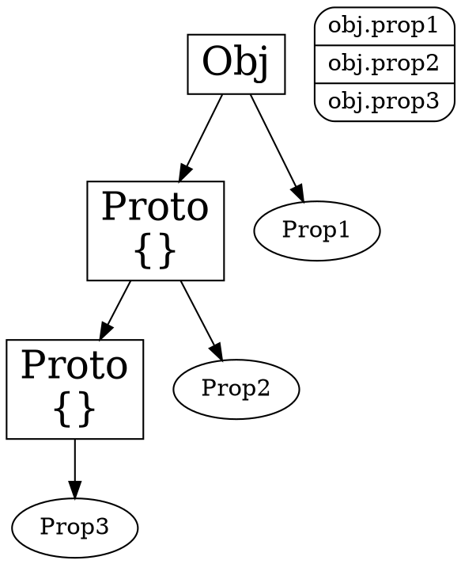
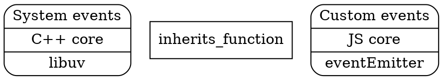

# Nodejs 📝

Notes, tips, thoughts and every thing came on my mind through learning Node.js. most notes written while taking [Learn and Understand NodeJS](https://www.udemy.com/understand-nodejs/learn/v4/overview) awesome course taught by
🙍 [@AnthonyPAlicea](https://twitter.com/AnthonyPAlicea).

---

**NodeJs is not javascript**, rather it accepts js and allows us to have more features than normal. Node has two Cores: **C++ core** and **Javascript Core**.



The *C++ core* is a core of features of utilities built in *C++* and made available in *javascript* via the *hook in v8 engine*. so basically it adds new feature to the V8 engine and therefore to the Javascript language itself using additional and wrapper functionalities written in c++.

It has also bunch of available javascript codes, to give the advantage of using those c++ functions in js, and ready to use functions for making coding easier.

> Nodejs is a Framework + library.

---

## 🔎 Definitions

### Primitive Variables

Type of data representing a **single value**.

✅ *String* or *Number* 

❌ *Array* or *Object*

> **Primitive variables**
> when sent as parameter to functions are copied.
>
> 🖊 *Pass by Value*

> **Non-Primitive Variables**
> when sent as parameter to functions are **not** copied.
>
> 🖊 Pass by Refrence

---

## 📝 Objects

Non-Primitive Variable type to created order-less name/value pares.

### Object Literals

defining an object using curly brackets and comma separated name/values.

```js
let obj = {
  name1 : 1,
  "name2" : "string",
  name3 : function () {}
}
```

### Prototypical Chain (Inheritance)

base concept is that *An object has access to methods and properties of another object, when assigned as value to it's **`proto`** name*.
The `.prototype` property of the function is what all objects created from that function constructor point to as their prototype.



Actually javascript has multiple ways of creating a prototype chain (objects inherit from their `proto` object). we can ^1^use `extends` keyword for ES6 Classes, ^2^use function constructors or ^3^use `create` method of the `Object` class.

> Prototype's properties and methods then can be overwritten by the object.
> in fact, it looks for properties in the object and if not found it would search the prototype.
> so base object's properties are safe to inherit by another object. (they're read-only)
> [name=Mohammad H. Sattarian]

#### Function Constructors

The `.prototype` property of the function is what all objects created from that function constructor point to as their prottotype.

```javascript

```

Properties and methods created inside function constructor are added directly to the objects being created oppose to being added to prototype.

#### ES6 classes and `extends`

By introducing `Classes` -syntactic sugar- in ES6 now we can inherit properties and methods from another object (Class) using `extends` keyword:
```javascript
class Person {
    constructor(firstName, lastName){
        this.firstName = firstName;
        this.lastName = lastName;
    }
    
    greet(){
        console.log(`Hello ${firstName} ${lastName}`);
    }
}

class John extends Person {

}
```

A class means it's essentially a constructor in itself, a creator of objects.
the `constructor` function inside class definition is equal the function constructor we used before. any other methods defined inside the class, would automatically put on the **prototype**.

#### `Object.create`
It Create a new empty object based on an other object. means that it sets new object's `proto`.
```javascript
let person = {
    firstName: '',
    lastName: ''
}

// Create object john based on person
let john = Object.create(person);
// It sets john's prototype as person.
// properties and methods can overwrite:
john.firstName = "john";
john.lastName = "Doe";

```


### 🔥 Function Constructors

When a function is called with "**new**" keyword, then "**this**" variable inside that function refers to the object itself and therefore, would automatically be an empty object (at first of creating function) for each instance and **return** as function's output.

In the code below `Person.prototype` is not the prototype of Person object, rather it's the prototype of objects created from Person.

```js
function Person () {
  this.fname = 'john';
  this.lname = 'doe';
}

Person.prototype.something = something
```

> 🖊 Prototypes can be accessed using `__proto__` property of the object. like:
> `Person.__proto__`

## 📝 Require

Nodejs *implements CommonJs modules*. it means it uses the standard described by CommonJS to provide a way of make our app modular.

### what happens when we require?


⭐ Every module is wrapped in this particular function:

```js
(function (exports, require, module, __filename, __dirname) {
  // OUR MODULE'S CODE
  return module.exports
\n});
```

> it's not a IIFE (Immediately Invoked Function Expressions) but it would be invoked soon afterwards with desired args
🔥 **thats how it knows module.exports**.

> So while writing code, the require function, module, _dirname, _filename are available to use because our code would wrap inside above function before giving to v8 engine.

> 🔥 Notice module's code is protected because it's in a function scope.

### More on Require

- when require sth if it can't find a .js file it would look for a folder with given name and imports the **index.js** file from that folder by default (given just the name of the folder).

- when we require a JSON file, an Object created of that JSON file would be returned.

- ⭐ changing required object would change other files required even though declaring like this:

  ```js
  function Greetr() {
    this.greeting = 'Hello world!!';
    this.greet = function() {
      console.log(this.greeting);
    }
  }

  module.exports = new Greetr();
  ```

   **why?** cause' *require* would actually **cache** and restore the function or what ever required for any particular filename.
  
  > 🔥 when you return an object from require that would be cached, and any other call to that same file via the require function would give you back the same object everywhere.

  so if deferent modules require the same file and use that, changes would be shared among them.
  
  - we can pass the constructor function itself and give the ability to create instances to user so that it would be able to make multiple unique objects:

    ```js
    function Greetr() {
      this.greeting = 'Hello world!!!';
      this.greet = function() {
        console.log(this.greeting);
      }
    }

    module.exports = Greetr;
    ```

    and use like this:

    ```js
    const Grtr = require(greetr);
    let instance = new Grtr();
    ```

### exports vs. module.exports

`exports` is a short-hand to `module.exports`, it means they both point at a same place in memory, the same object. but it has a small problem, 🔥 **as the *require function* returns `module.exports`**, when we change exports like the code below the `module.exports` wouldn't change cause it was copied by refrence to `export` and now the link (reference) is broken.

```js
exports = function () {...}
```

so we shouldn't change the `exports` but should mutate (change) it:

```js
exports.func1 = function () {...}
```

## ES6 modules

As #ES6 standard, Javascript now supports modules:

> this means the V8 engine itself supports it, not the addon functions.

```js
// Exporting
export function () {...};

// importing
import {*} as fancy from 'fancy.js';
```

## JSON

- should not have comment or function cause it's pure data to send.
- names should wrap in "quotes".

## Events

There is two kind of events in node:



🔖 [Kinds of events](https://www.udemy.com/understand-nodejs/learn/v4/t/lecture/3566480?start=78)

> Sometimes when a system event occurs in `libuv` it generates a *Custom Event* to make handling Events easier.

Js part actually is not able to make events cause it has no event concept or event object. So its faking it by creating it's own way of controlling events

## The Event Emitter

In JavaScript an Event listener is a function which would call by triggering that event. 🔥 multiple listeners can be attached to an event, but they would call one at a time rather than simuntaniasly.

> First we should add event listeners to handle an event, then by emitting that event all event listeners of that event would execute.
> [name=Mohammad H. Sattarian]

🔥 Events are actually just and object consist of event name as property names and arrays of function (listeners) as values. each time an event is emitted it will call all the listeners respectively.

```javascript
events = {
    "eventType" : [function (){}, function (){}]
}
```

### The Nodejs Event library

require it:

```js
const Events = require('events') // Gives back the constructor
const evt = new Events();
```
use it:

```js
evt.on("event1", ()=>{
    // Handle Event
});

evt.emit("event1");
```

the `on` function which is a shorthand for`addListener` function would receive `type` and `listener` as parameters, search in events object for that type event, then add the listener to it's array of listeners.

> actually in nodejs not until the second listener is add to an event type it's not an array but just a function. 
>  [name=Mohammad H. Sattarian]

#### Small problem?

> relying on strings in code to be the base of a logic can be problematic. this relying is called magic string.
> [name=Mohammad H. Sattarian]

To fix this we can have a file (say a JSON file), a module, exporting an object containing all events an access event names through this object:

```js
// Defining Events names
module.exports = {
    events : {
        eventName : "actuall name",
        onClick: "on clike"
    }
}

// Then use like:
evt.emit(events.onClick)
/* Notice onclick is a property and not a string*/
evt.on(events.onClick, ()=>{...})
```

## Inherit from Event Emitter


> we want to create an object that does more than what EventEmitter does, but also does what EventEmitter does.
> [name=Mohammad H. Sattarian]

`inherits (ctor, superCtor)` function available in `util` core package can be used to handle inheritance easily. it gets properties and methods of **prototype** of `superCtor` function constructor and add them as `ctor` function constructor's prototype.

> It would overwrite existing prototype on the `ctor` function. So it should be used before adding stuff to prototype
> [name=Mohammad H. Sattarian]

#### what is going on?

Let me explain: have a look at ode below, say the `eventEmitter` is the output (what is assigned to module.exports) of the `events` core package, cause the `eventEmitter` is a function constructor and it has `on()` and `emit()` functions in it's prototype (that's how we have access to them in functions we build using `new eventEmitter`), by accessing the prototype of the `eventEmitter` we have access to the `on()` and `emit()` functions.
so if we add them to prototype of our own function constructor, all objects created based on our function constructor will have access to the `on()` and `emit()` functions.

```javascript
var EventEmitter = require('events');
var util = require('util');

// Our very own function constructor
function Greetr() {
	this.greeting = 'Hello world!';
}

// Adding EventEmitter's prototype (on and emit functions) 
// to our own function
util.inherits(Greetr, EventEmitter);

Greetr.prototype.greet = function(data) {
	console.log(this.greeting + ': ' + data);
    // So we have access to emit method
	this.emit('greet', data);
}

var greeter1 = new Greetr();

// Any instance will have access to on method
greeter1.on('greet', function(data) {
	console.log('Someone greeted!: ' + data);
});
```

## Tips Library 📚

### String Formatting

```js
require('util');

util.format('format this %s', "string");
```

### Log

```js
require('util');

util.log('log') // Adds timestamp to the log
```

### Events

```js
const Events = require('events') // Gives back the constructor
const evt = new Events();

evt.on("event1", ()=>{
    // Handle Event
});

evt.emit("event1");
```

### Dynamically grab object properties

```js
let key = "keyName";
let prop = Obj[key];
```

### Call function

The `call()` method calls a function with a given `this` value and arguments provided individually.

```js
function Product(name, price) {
  this.name = name;
  this.price = price;
}

Product.call(this, name, price);
```

### Apply function

The `apply()` method calls a function with a given `this` value, and arguments provided as an array (or an array-like object).

```javascript
let numbers = [5, 6, 2, 3, 7];
let max = Math.max.apply(null, numbers);
```

### Jquery with no jquery! [:link:](https://gist.github.com/paulirish/12fb951a8b893a454b32)

```js

/* bling.js */

window.$ = document.querySelectorAll.bind(document);

// window.$ = document.querySelector.bind(document);
// window.$$ = document.querySelectorAll.bind(document);

Node.prototype.on = window.on = function (name, fn) {
  this.addEventListener(name, fn);
}

NodeList.prototype.__proto__ = Array.prototype;

NodeList.prototype.on = 
NodeList.prototype.addEventListener = function (name, fn) {
  this.forEach(function (elem, i) {
    elem.on(name, fn);
  });
}
```

### Addressing to `node_modules` directory

**Just in angular?** using tilda `~` in our addressing we speciafy `node_modules` directory like this:

```javascript
import '~leaflet/core/markers.js'
```

This Works fine and our objects created from our function constructor has access to `on()` and `emit()` function. but in this approach the `on()` and `emit()` functions are accessible using `prototype`.

🔥 What if we wanted to add this properties and methods to the new object being created itself?
What if the super constructor (here the EventEmitter) adds some properties and methods directly to the object, not necessarily the prototype?

We are not including those in our new object. so it's an incomplete form of inheritance. we can fix that up with one line of code:

```javascript
// Our very own function constructor
function Greetr() {
    // Super constructor happening (explained below )
    EventEmitter.call(this); 
    // So on() and Emit() functions attach to 
    // this function constructor's objects themselves
    // and not to their prototypes
    this.greeting = 'Hello world!';
}
We've already seen the EventEmitter, the custom events that are JavaScript based existing inside node. we said that, that was really just a trick; it's really an object containing some properties, which are arrays of functions.

**System events**, handled inside *C++* side of the core, are actually handled by a *C* library called **`libuv`**, which is also embedded in Node and used elsewhere.
The idea is managing events coming from the operating system.

```## Web Server Checklist

- [x] Better ways to organize our code into **reusable pieces**
- [x] Ways to deal with **files**
- [x] Ways to deal with **databases**
- [x] The ability to **communicate** over the internet
-
console.log(buf[2]) //=> 108
```

we also can write to existing buffer like so:

```javascript
buf.write('wo');
console.log(buf.toString()) //=> wollo
```

As you notice the 'wo' is replacing the first two characters of the buffer. remember the buffer is a finite piece of data, and cause we initialized it with five characters, it overwrites those two. it didn't expand or stretch it and started to overwrite the data in the buffer.

Buffers exist in Node cause the JavaScript didn't have good ways to deal with binary data. but that is Changing in *ES6*:

#### ES6 Typed Arrays

V8 engine now supports the `ArrayBuffer` and JavaScript typed arrays. so it's not nodes it's JavaScript.

```javascript
// Accepts bytes
let buffer = new ArrayBuffer(8)
```

then we can create a `view` which is a typed array. it's actually a way to deal with the binary data in the buffer. if I read/change the array, I'm actually reading/changing the buffer. and it will convert that binary data into whatever structure I say:

```javascript
// Creating 32bit numbers
// As we had 64 bit, we have 2 numbers
let view = new Int32Array(buffer);

view[0] = 5;
view[1] = 15;

console.log(view) //=>
// Int32Array{'0' : 5, '1': 15}
```

So here numbers are converting to 32bits.

if we try to put a third number, it doesn't work but no error is given:

```javascript
view[2] = 30;

console.log(view) //=>
// Int32Array{'0' : 5, '1': 15}
```

## Files and `FS`

Nodejs provides ways to work with binary files from the system available in `fs` package inside Node:

## `readFileSync`

this method allows reading the file in a **syncronous** way, so while it's reading the file, no other code is running:

```javascript
const fs = require ('fs');

let greet = fs.readFileSync(__dirname + '/greet.txt', 'utf8');
// => Hello World! (the actual content)
```


## readFile

this method provides a **asyncronous** way to read files content and accepts a callback to invoke when it's done reading:

```javascript
// callback is Error-first
let greet = fs.readFile(__dirname + '/greet.txt', function(err, data){ 
    console.log(data);
    // data would be the Buffer object (rather the actual content)
    // => <Buffer 45 87 36 7f 3d ...>
});
``` [x] The ability to accept **requests** and send **responses** (in the standard format)
- [x] A way to deal with works that **takes a long time**